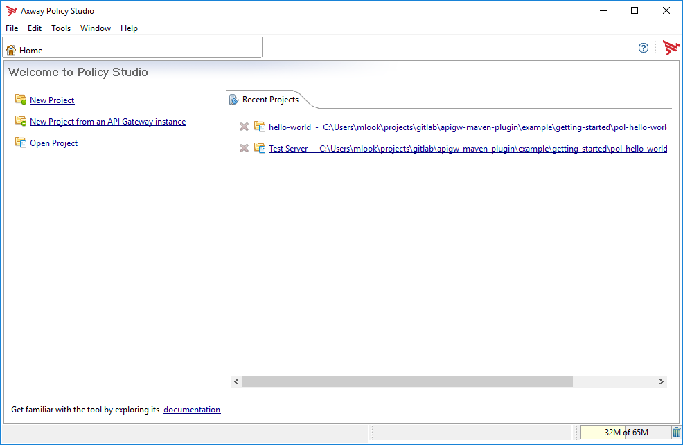
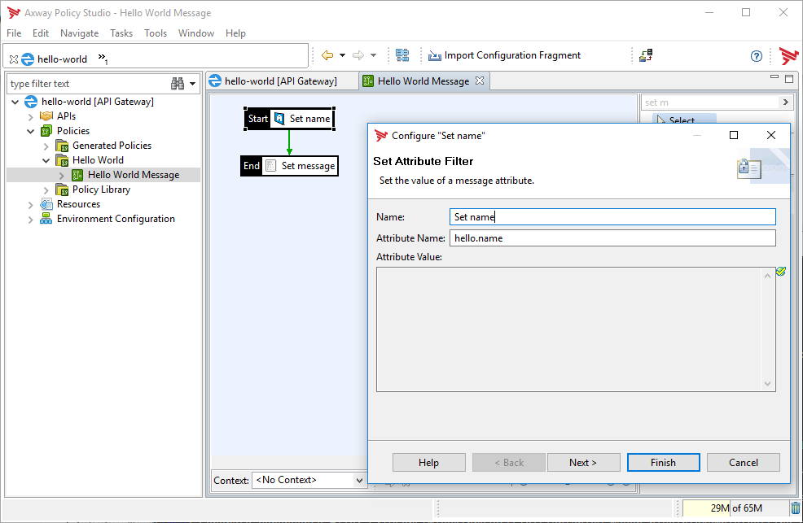
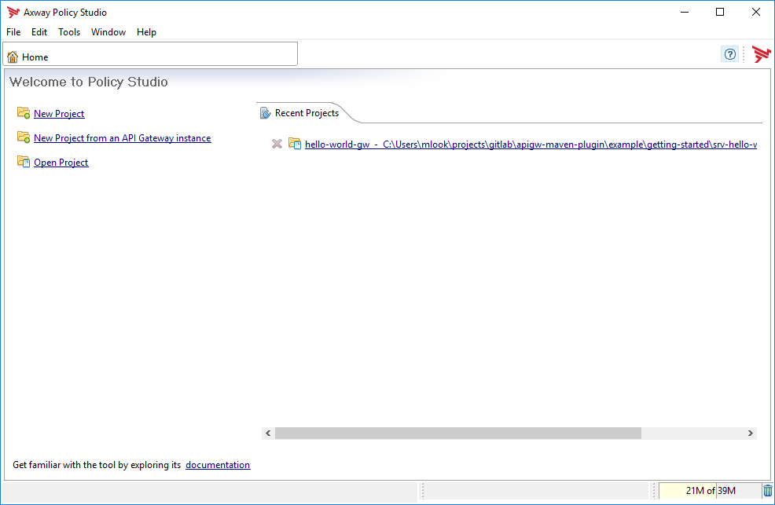
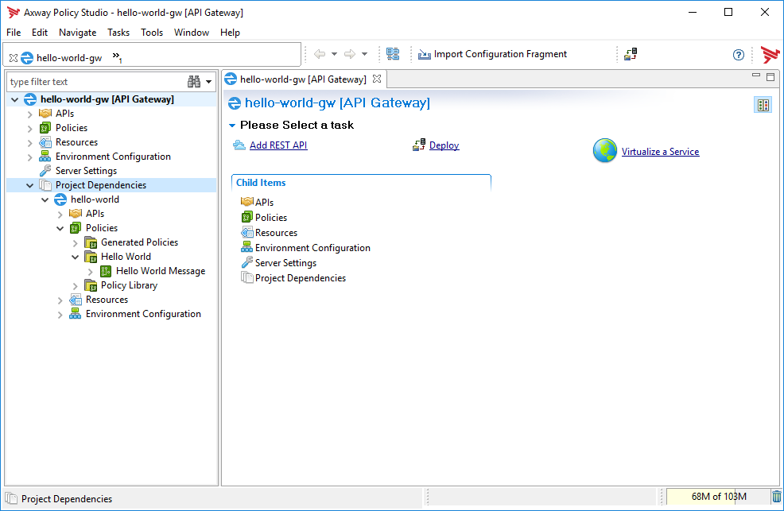
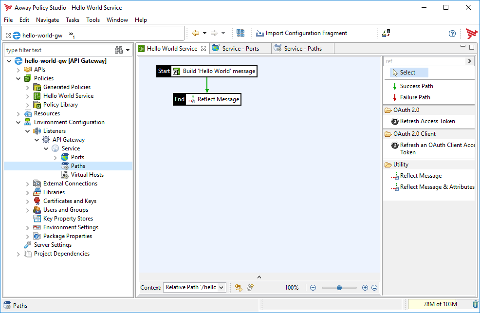
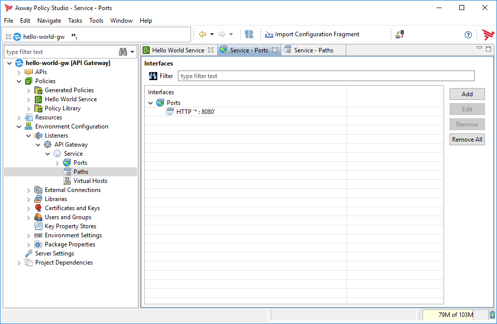
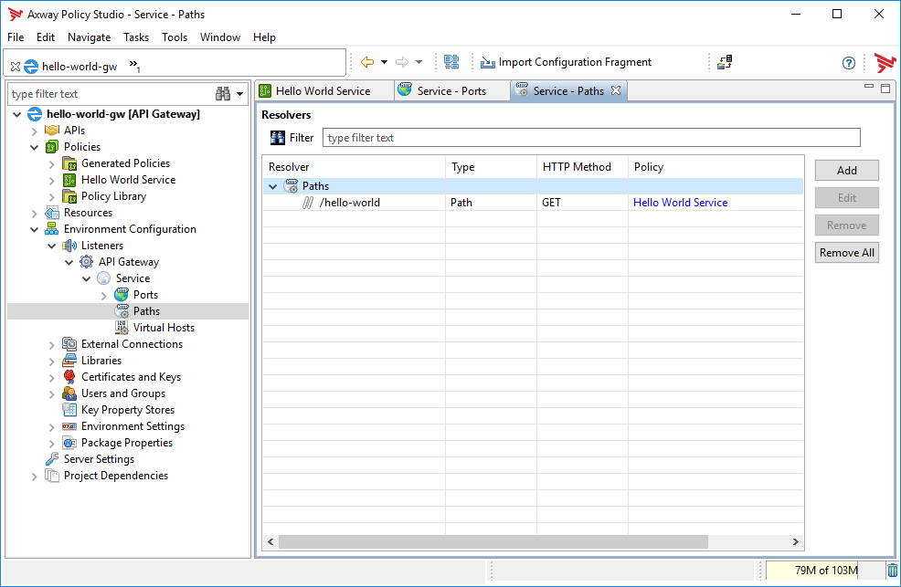

= Getting Started
:Author: Martin Look
:Email: mlook@axway.com
:toc:
:sectnums:
:source-highlighter: prettify

:mvn-plugin-ver: 0.12.0

Here you get a simple introduction on how to use the _Maven Plugin for Axway API Gateway_.
It assumes that you are familiar with https://maven.apache.org[Apache Maven] and that you are familiar with PolicyStudio and the API Gateway.

== Install Maven Plugin

First you have to install the Maven plugin for Axway API Gateway.
Clone the repository on your machine and install the plugin:

  $ cd apigw-maven-plugin
  $ mvn clean install

The Axway API Gateway Maven plugin is now installed on your machine.

The plugin requires the installation of the Axway API Gateway _Package and Deploy Tools_.
The location of the software has to be specified by the property `axway.home`.
Due to the location is individual for each developer, configure the property in your `~/.m2/settings.xml` file.

.~/.m2/settings.xml
[source,xml]
----
<settings
  xmlns="http://maven.apache.org/SETTINGS/1.0.0"
  xmlns:xsi="http://www.w3.org/2001/XMLSchema-instance"
  xsi:schemaLocation="http://maven.apache.org/SETTINGS/1.0.0 https://maven.apache.org/xsd/settings-1.0.0.xsd"
>
	<profiles>
		<profile>
			<id>axway</id>
			<activation>
				<activeByDefault>true</activeByDefault>
			</activation>
			<properties>
				<axway.home>C:/Axway-7.6.2</axway.home> <!--1-->
			</properties>
		</profile>
	</profiles>
	<activeProfiles>
		<activeProfile>axway</activeProfile>
	</activeProfiles>
</settings>
----
<1> Specify the location of your Axway installation here.

== Policy Project

As a first step we will create a simple policy project.
A policy project contains shared and reusable policies.
No server setting are included in a policy project.

=== Initialize Project

To create a policy project create new folder (e.g. `pol-hello-world`) and create a `pom.xml` file (see template below).

.pom.xml
[source,xml,subs="verbatim,attributes"]
----
<project
  xmlns="http://maven.apache.org/POM/4.0.0"
  xmlns:xsi="http://www.w3.org/2001/XMLSchema-instance"
  xsi:schemaLocation="http://maven.apache.org/POM/4.0.0 http://maven.apache.org/xsd/maven-4.0.0.xsd"
>
  <modelVersion>4.0.0</modelVersion>

  <groupId>com.example</groupId> <!--1-->
  <artifactId>hello-world</artifactId> <!--2-->
  <version>0.1.0-SNAPSHOT</version> <!--3-->
  <packaging>axway-policy-archive</packaging> <!--4-->

  <name>Hello World Policy</name>
  <description>My first "Hello World" policy project.</description>

  <build>
    <plugins>
      <plugin> <!--5-->
        <groupId>com.axway.maven.plugins</groupId>
        <artifactId>apigw-maven-plugin</artifactId>
        <version>{mvn-plugin-ver}</version>
        <extensions>true</extensions>
      </plugin>
    </plugins>
  </build>
 </project>
----
<1> Define the group ID of your artifact.
<2> Define the name of your artifact.
<3> Define the version of your artifact.
<4> The packing type `axway-policy-archive` marks it as a policy project.
<5> Use _Maven Plugin for API Gateway_ for this project.

To initialize the project invoke the Maven goal `apigw:init`.

 $ mvn apigw:init

TIP: All goals which are specific to the _Maven Plugin for API Gateway_ have the prefix `apigw:`.

This will create a source folder with an empty policy project based on a factory template.
For testing purpose it also creates an empty policy project with server configuration.

=== Edit Project

To edit the policies start PolicyStudio by calling the Maven goal `apigw:policystudio`.

 $ mvn apigw:policystudio

[NOTE]
====
If PolicyStudio is started the first time in the project directory, it has to be initialized first.

In this case you will be prompted to close PolicyStudio right after startup.
So, just close PolicyStudio and invoke the Maven goal `apigw:policystudio` again.
You have to do this only once.
====

This will open PolicyStudio.
The recently used projects are automatically configured by the plugin.
So you don't have to search for your source code.
Just select your policies or the _Test Server_ project.

Open the "hello-world" project and create a simple policy (see screenshot).
Configure PolicyStudio to support environmentalization. For demonstration environmentalize the _Attribute Value_ of the `hello.name` attribute.

Close your project.

=== Build Project

To build the package and to install it into your local Maven repository just invoke the according goals:

 $ mvn clean install

This will create a `hello-world-0.1.0-SNAPSHOT.axpar` artifact and will install it into your local repository.

== Server Project

For building an environment independent API Gateway instance create a separate folder (e.g. `srv-hello-world`) and create a server project `pom.xml` file (see template below).

.pom.xml
[source,xml,subs="verbatim,attributes"]
----
<project
  xmlns="http://maven.apache.org/POM/4.0.0"
  xmlns:xsi="http://www.w3.org/2001/XMLSchema-instance"
  xsi:schemaLocation="http://maven.apache.org/POM/4.0.0 http://maven.apache.org/xsd/maven-4.0.0.xsd"
>
  <modelVersion>4.0.0</modelVersion>

  <groupId>com.example</groupId>
  <artifactId>hello-world-gw</artifactId>
  <version>0.1.0-SNAPSHOT</version>
  <packaging>axway-server-archive</packaging> <!--1-->

  <name>Hello World Server</name>
  <description>My first "Hello World" server project.</description>

  <dependencies>
  	<dependency> <!--2-->
  		<groupId>com.example</groupId>
  		<artifactId>hello-world</artifactId>
  		<version>0.1.0-SNAPSHOT</version>
  		<type>axway-policy-archive</type>
  	</dependency>
   </dependencies>

  <build>
    <plugins>
      <plugin> <!--3-->
        <groupId>com.axway.maven.plugins</groupId>
        <artifactId>apigw-maven-plugin</artifactId>
        <version>{mvn-plugin-ver}</version>
        <extensions>true</extensions>
      </plugin>
    </plugins>
  </build>
 </project>
----
<1> The packaging type `axway-server-archive` marks it as a server project.
<2> Include the dependency of your previously created policy archive.
<3> Use _Maven Plugin for API Gateway_ for this project.

As before, to initialize the project invoke the Maven goal `apigw:init`.

 $ mvn apigw:init

This will create a source folder with an empty server project based on a factory template.

=== Edit Project

Same as before, to edit the policies start PolicyStudio by calling the Maven goal `apigw:policystudio`.

 $ mvn apigw:policystudio

NOTE: For the first start of PolicyStudio in this project you have to close PolicyStudio after startup and invoke the goal again.

The dependent policy archive will automatically downloaded from the Maven repository and will be extracted in a temporary folder.
The recently used project is automatically configured by the plugin.

Open your project.
PolicyStudio will automatically ask you to enable environmentalization and team development.

As you can see the dependent `hello-world` project was automatically configured by the plugin.

Develop a very simple policy to call the previously created _Hello World Message_ policy.

And configure the according listeners.

Close your project and close PolicyStudio.

=== Build Project

As usual, build the package and install it to your local Maven repository.

 $ mvn clean install

This will create a `hello-world-gw-0.1.0-SNAPSHOT.axsar` artifact and will install it into your local repository.

== Deployment Project

For building an environment specific API Gateway instance create a separate folder (e.g. `dpl-hello-world`) and create a deployment project `pom.xml` file (see template below).

.pom.xml
[source,xml,subs="verbatim,attributes"]
----
<project
  xmlns="http://maven.apache.org/POM/4.0.0"
  xmlns:xsi="http://www.w3.org/2001/XMLSchema-instance"
  xsi:schemaLocation="http://maven.apache.org/POM/4.0.0 http://maven.apache.org/xsd/maven-4.0.0.xsd"
>
  <modelVersion>4.0.0</modelVersion>

  <groupId>com.example</groupId>
  <artifactId>hello-world-dev</artifactId> <!--1-->
  <version>0.1.0-SNAPSHOT</version>
  <packaging>axway-deployment-archive</packaging> <!--2-->

  <name>Hello World (DEV)</name>

  <properties>
    <!--3-->
    <!--
    <axway.config.certs>${basedir}/src/main/axwgw/gateway-cert.json</axway.config.certs>
    <axway.config.props>${basedir}/src/main/axwgw/gateway-prop.json</axway.config.props
    -->
  </properties>

  <dependencies>
    <dependency> <!--4-->
      <groupId>com.example</groupId>
      <artifactId>hello-world-gw</artifactId>
      <version>0.1.0-SNAPSHOT</version>
      <type>axway-server-archive</type>
    </dependency>
  </dependencies>

  <build>
    <plugins>
      <plugin> <!--5-->
        <groupId>com.axway.maven.plugins</groupId>
        <artifactId>apigw-maven-plugin</artifactId>
        <version>{mvn-plugin-ver}</version>
        <extensions>true</extensions>
      </plugin>
    </plugins>
  </build>
 </project>
----
<1> Environment specific artifact, so the name should include the target environment.
<2> The packaging type `axway-deployment-archive` marks it as a deployment project.
<3> Optionally specify additional configuration files.
<4> Include the dependency of your previously created server archive.
<5> Use _Maven Plugin for API Gateway_ for this project.

To initialize the project invoke the Maven goal `apigw:init`.

 $ mvn apigw:init

This will create a source folder with an empty configuration file.

.src/main/axwgw/gateway.config.json
[source,json]
----
{}
----

=== Build & Configure Project

Build the package.

 $ mvn clean package

We use envionmentalized fields in our project.
The plugin scans for environmentalized fields and set the values from the configuration.
As we haven't configured our project yet, the build will fail.

For convenience the plugin will automatically add new fields to the configuration file (see below).

.src/main/axwgw/gateway.config.json
[source,json]
----
{
  "entities": {
    "/[CircuitContainer]name=Hello World/[FilterCircuit]name=Hello World Message/[SetAttributeFilter]name=Set name": { <1>
      "description": "", 
      "fields": {
        "attributeValue#0": { <2>
          "source": "value", <3>
          "type": "string", <4> 
          "used": true, <5>
          "value": null <6>
        }
      }
    }
  }
}
----
<1> Short handed key of the environmentalized entity.
<2> Name and index of the environmentalized field.
<3> Specifies that the field value is literally retrieved form "value".
<4> Type of the field (just for documentation, don't change it).
<5> Indicates if the configured field is used.
If _false_ the field is no longer environmentalized or the entity is renamed or removed.
The property is automatically maintained by the plugin. 
<6> Literal value of the field. _null_ indicates an unconfigured field.

TIP: When the configuration file is written by the plugin, all JSON properties are sorted.
This makes diff & merge easy.

Now configure the field in the configuration file.

[source,json]
----
{
  "attributeValue#0": {
    "source": "value",
    "type": "string",
    "used": true,
    "value": "Fred" <1>
  }
}
----
<1> Your configured value.

And build your project again.

 $ mvn clean package

Now the build succeeds and a deployment archive `hello-world-dev-0.1.0-SNAPSHOT.axdar` containing the `.fed` file is created.

For manual checks via ConfigurationStudio the content of the archive is located in the `target/axway-archive` folder.

== Deployment

The project can be deployed to a gateway via the plugin.

Just invoke the `apigw:deploy` goal within the deployment project and specify the target domain and group.

In the following example it is assumed that the Admin Node Manager is located at `localhost:8090`.
The user `admin` is allowed to deploy projects and has the password `changeme`.
The project shall be deployed to the group `test`. 

  $ mvn -Daxway.anm.host=localhost -Daxway.anm.port=8090 \
    -Daxway.anm.user=admin -Daxway.anm.password=changeme \
    -Daxway.deploy.group=test \
    clean apigw:deploy

